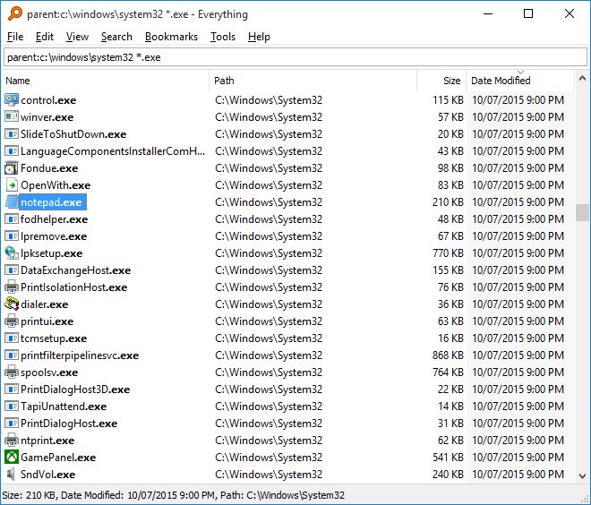
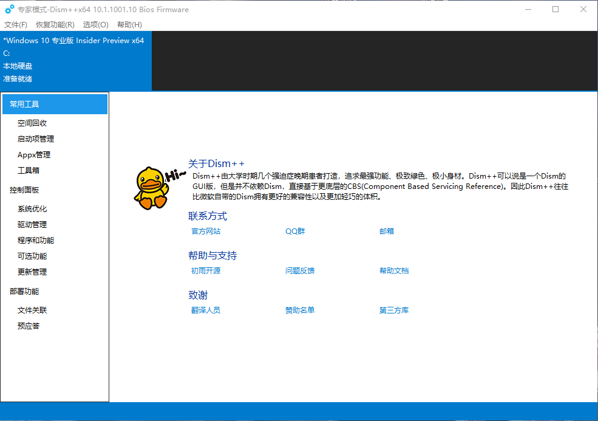

# 前言
众所周知，我国的软件生态环境属实恶劣。所以我根据个人软件使用习惯和互联网冲浪经验，总结了一些绿色、纯净、实用的软件，覆盖了各个方面和种类，希望能够对你有所帮助。

本采用采用 [知识共享 署名-相同方式共享 4.0 国际许可协议](https://creativecommons.org/licenses/by-sa/4.0/) 进行许可。

*本文所有推荐的免费软件均可在[物语云资源中心](https://dl.wuyuidc.com)获取，该站仅为方便广大用户使用，对官方发布的原文件毫无修改的镜像加速，如有需要可自行验证哈希值。也不会以镜像的任何文件盈利。若侵犯到有关方面的权利，可直接与我联系，我们将会积极配合处理。*

## 浏览器
## Chrome
Chrome 是由 Google 打造的多功能高性能网页浏览器，是目前最为主流的一种浏览器。[Chromium](https://www.chromium.org/) 是其开源内核，也是为众多浏览器所采用的的内核。总之就非常好用就是了，由于众所周知的原因，Chrome的拓展插件商店在大陆无法舒适地访问，因此我个人十分推荐微软基于 Chromium 内核开发的 [Edge 浏览器](https://www.microsoft.com/zh-cn/edge?r=1)。

[官方网站](https://www.google.cn/chrome/)

## FireFox
Mozilla Firefox，俗称“火狐”（正式缩写为Fx或fx），是由 Mozilla 基金会开发的自由及开放源代码的网页浏览器，也是目前市场占有率仅次于 Chrome 的主流浏览器。
由于新版本 Windows 都预装了 Edge 浏览器的缘故，加上我也是 Chrome 的忠实守护者，所以也就没怎么使用过较新版本的 FireFox ，所以对于实际使用体验并没有什么资格评价，但我觉得官网的设计是真的非常棒！

[官方网站](https://www.mozilla.org/zh-CN/firefox/new/)

## 压缩包
### BandiZip

[官方网站](http://www.bandisoft.com/)

> Bandizip 是一个强大的多功能压缩文件管理工具，可提供很快的解压缩速度和其他各种实用功能。 这是一个免费的软件，其付费版本更是可以使用更多的实用功能。

与WinRAR一样，BandiZip的免费版本同样拥有令人不适的广告植入，尽管这是软件开发商为了盈利的无奈且必要之举。但相比起使用破解版的WinRAR，BandiZip的最后一个无广告免费版本v6.29就成了合情合理合法的最佳选择。
BandiZip与WinRAR的具体区别我并没有进行详细的对比，仅从我个人的使用体验来讲，BandiZip的功能有过之而无不及，同时BandiZip更现代的扁平化风格，也是已经深入人心的优秀方案。

[6.29版本下载](https://www.bandisoft.com/bandizip/old/6/)

**注：根据官网信息，6.x版本疑似存在安全漏洞，因此请您自行选择是否使用该版本。**

### 7Zip

[官方网站](https://www.7-zip.org/)

> 7-Zip 是一款 开源 的 免费 软件。大多数源代码都基于 GNU LGPL 许可协议下发布。部分代码基于 BSD 3 句条款（BSD 3-clause）许可协议发布。并且，部分代码受到了 unRAR 许可协议的限制。

7z是非常知名的一款压缩软件和压缩格式。尽管包括BandiZip在内的绝大多数压缩包管理工具都支持对7z格式的压缩和解压缩，但7z官方本体的简洁和高性能深深地吸引了我。
一般我会将BandiZip和7z两款压缩包软件同时安装，日常使用BandiZip，数据量大的压缩和解压就会使用7z了。根据个人使用发现，7z支持的处理器线程数比BandiZip更多一些，不清楚是我的设置问题还是本身如此，未做进一步求证。

## 下载器
### Motrix

[官方网站](https://motrix.app/zh-CN/)

> Motrix是一款基于electron开发的跨平台下载软件，核心下载服务还是由aria2c支持，是一款精品的下载工具，支持支持下载HTTP、FTP、BT、磁力链、百度网盘等资源，是一款不可多得的高颜值下载软件。

Motrix 是我最近才了解到的一款下载器，本来我以为 FDM 已经足够简洁实用了，但当我安装了 Motirx 的那一刻，我想对我的 FDM 说：“对不起，这一别可能就是永远了。”
就我个人使用而言，Motrix 比起 FDM 最大的优势就是可以自定义下载时的 User-Agent ，这对于经常在某度网盘上下载懂得都懂影片的我来说，简直就是莫大的福音，我终于可以不再使用破解版的界面丑陋的 [IDM](https://www.internetdownloadmanager.com/) 了！（不知道为什么IDM非要创建一堆文件夹非常烦）

### Free Download Manager

[官方网站](https://www.freedownloadmanager.org/zh/)

Free Download Manager 简称 FDM，是一款和 [IDM](https://www.internetdownloadmanager.com/) 各方面都非常类似的下载工具，其特点是跨平台且支持磁力链接和 BT 下载，界面简洁，支持中文，无广告且完全免费！

由于 IDM 是付费软件，且界面和使用体验属实是给我整不会了，所以我在多年以前了解到了 FDM 这一款下载器，它在早期的版本是开源的，不过最新的版本已经是完全闭源的了。如果我没有了解到 Motrix 的话，FDM 恐怕会是我对下载器的唯一推荐。

## 文本编辑器
### NotePad++
NotePad++ 是一款免费开源的文本编辑器，仅支持 Windows 平台。

本身这个编辑器是挺好的，非常适合我的工作流程使用，但是我就不知道这个脑瘫开发者的母亲是什么时候寄了，它就要辱华，它就要展示一下自己微弱的存在感，纯粹是恶心国人。不过因为软件本身是开源的，其实可以fork一份出来改个名字搞黑命贵，但暂时还没发现有这么搞的好心人，也许是因为GPG签名的问题。

所以我也就不放官网链接了，有需要的自行查找获取吧。

### Visual Studio Code

[官方网站](https://code.visualstudio.com/)

Visual Studio Code 简称 VSC ，是微软开发套件 Visual Studio 系列里的一个轻量级文本编辑器，相比 NotePad++ 功能丰富得多，甚至支持云同步跨平台编辑，也更像是一个 IDE 了。

不过我个人并不是很习惯 VSC 的使用逻辑，同样不是很适应的话可以下载 [IntelliJ IDEA](https://www.jetbrains.com/idea/) ，但 IDEA 就是一个完整且现代化的 IDE 了，文本编辑只是其中一个附带的功能，而且文件体积也大得多，可以酌情选择。

另外 JetBrains 即将推出全新的次时代 IDE：[Fleet](https://www.jetbrains.com/fleet/)，目前处于内测阶段，有兴趣可以关注一下。

### Atom

[官方网站](https://atom.io/)

> A hackable text editor for the 21st Century

Atom 是 Github 开发的免费开源的文本编辑器。

我个人接触次数并不多，之前使用它的原因是因为原生支持编辑亲儿子语言 Markdown ，和 VSC 类似，也支持跨平台编辑，内置包管理器，总之还算是功能比较全面的了。

### Sublime Text

[官方网站](https://www.sublimetext.com/)

Sublime Text 也是一款轻量级的文本编辑器，不过它是付费的而且价格不菲，但有试用版可以免费体验。推荐它的原因是因为界面还算是非常简洁干净，功能也很丰富，不过我个人就没有使用过了，可以作为riiiiich man的文本编辑解决方案。

## 多媒体工具
### PotPlayer

[官方网站](https://potplayer.daum.net/)

PotPlayer 是 KMPlayer 作者换公司之后基于 KMPlayer 开发出来的一款非常强大且专业的免费开源的多媒体播放器，就我目前网上冲浪的经验也无法找到比 Potplayer 更加简洁实用且绿色的播放器了，由于我对数字媒体相关了解不多，无法从专业角度介绍这款播放器，但是从一个使用者的角度讲，选她就对了！

我真的太感谢 PotPlayer 的作者了，它真的是彻彻底底地将开源软件精神践行到了极致，我愿称之为自由软件运动的伟大战士！

### Open Broadcaster Software

[官方网站](https://obsproject.com/)

Open Broadcaster Software 简称 OBS，是一款非常专业强大且免费开源的视频流工具，支持多平台，是目前最为主流的直播推流软件。

OBS 支持极其细致的推流和录屏参数配置，以及直播场景部署。诸多直播平台自己的直播管理软件也是基于 OBS 二次开发的。

## 文件管理
### Everything

[官方网站](https://www.voidtools.com/zh-cn/)

> "Everything" 是 Windows 上一款搜索引擎，它能够基于文件名快速定文件和文件夹位置。
不像 Windows 内置搜索，"Everything" 默认显示电脑上每个文件和文件夹 (就如其名 "Everything")。
您在搜索框输入的关键词将会筛选显示的文件和文件夹。

Windows 资源管理器自带的文件搜索属实是太拉胯了，以至于让我怀疑它真的在认真找但是却找不到。Everything 的效率恐怕会让你大吃一惊，无论藏在任何一个角落，它都能在一瞬间帮你找到，让你的无论是小姐姐还是大姐姐都无所遁形。

### WizTree

[官方网站](https://www.diskanalyzer.com/)

Wiztree 是一款强大的磁盘空间占用分析工具，能够帮你找出磁盘空间不足的罪魁祸首。

它吸引我的一点在于能够通过色块的形式生动形象地展示出到底是哪个大傻卵占了我那么多空间。况且，它对于个人性质的使用是完全免费的，除了会有一个小小的捐赠按钮以外，和企业版似乎并没有什么区别。

## 系统相关
### 火绒

[官方网站](https://www.huorong.cn/)

> 专业尽职  极致低调  只为巩固安全防线

火绒恐怕不必过多介绍，它是一款干净、简单、轻巧、易用的安全软件，相比其他厂商的全家桶式安全管家，火绒着实可以说是一股清流了。

### DirectX Repair

[官方网站](https://blog.csdn.net/vbcom/article/details/6962388)

> DirectX修复工具 (DirectX Repair) 是一款系统级工具软件，简便易用。
主要功能是检测当前系统的DirectX状态，如果发现异常则进行修复。

顾名思义，DirectX 修复工具是专门针对 DirectX 的修复工具，而 DirectX 是 Windows 平台的多媒体编程接口，不仅是游戏客户端，诸多游戏服务端也会需要调用 DirectX。如若 DirectX 的运行出现了问题，DirectX 修复工具便是你的大救星。

推荐这款软件的原因是，它除了能修复 DirectX 问题之外，还能够一键安装包含API Sets 的 VC++ 运行库，简直是装机必备法器！

### Dism++

[官方网站](https://github.com/Chuyu-Team/Dism-Multi-language)

> Dism++ 可以说是一个Dism的GUI版，与其他Dism GUI不同的是，Dism++ 是API级别与微软自家Dism共同核心，因此不依赖Dism.exe；得益于API级别，Dism++还可以让微软刻意隐藏的功能重见天日，比如ESD捕获，ESD转WIM等功能。

Dism++ 是一款 Windows 系统管理优化工具，它解决了我们安装、维护系统的一大痛点问题——自定义设置和优化。相当于一个 “一站式” 管理优化工具集。

它把用户使用、调整频率较高的选项集合到一起，让我们可以使用它快速地完成电脑的自定义设置和优化，而不需要一层层地打开在不同位置的设置选项逐个调整，极大地方便了我们的操作。

**注： Dism++ 的一些操作可能对系统存在不可逆的影响，请注意结合自己的使用情况按需谨慎使用。**

## 远程连接
### mRemoteNG

[官方网站](https://mremoteng.org/)

> 还在使用Windows自带的mstsc吗？还在为切换多个远程桌面而痛苦不已吗？想不想换个远程桌面程序呢？如果您的答案是Yes，那么我向您推荐mRemote。至今为止，我用过的最好的远程桌面工具。

mRemoteNG 是 mRemote 的一个分支项目，它是免费开源的、支持多协议的、选项卡的远程连接管理器。mRemoteNG 对 mRemote 进行了诸多优化和增强。

相比 Windows 自带的 mstsc 来说，mRemoteNG  能够分类保管每个远程连接，妥善报错每个连接的信息和设置，并且支持RDP、SSH 和 VNC 在内的多种远程协议，最重要的是能够使用标签页实时管理每个连接，非常方便！

[Xmanager](https://www.xshell.com/zh/xmanager/) 同样拥有这些功能，但它是付费的，我也没用过。

### SecureCRT

[官方网站](https://www.vandyke.com/products/securecrt/)

> 适用于 Windows、Mac 和 Linux 的 SecureCRT 客户端为计算专业人员提供了坚如磐石的终端仿真，通过高级会话管理以及一系列节省时间和简化重复性任务的方法提高了工作效率。SecureCRT 为组织中的每个人提供安全的远程访问、文件传输和数据隧道。

> 无论您是要更换Telnet还是终端，还是需要更强大的安全远程访问工具，SecureCRT都是您可以整天使用的应用程序。凭借SSH的可靠安全性，广泛的会话管理和高级脚本，SecureCRT将帮助您将工作效率提高到第n个程度。

SecureCRT 是我自接触 Linux 以来就在使用的 SSH 终端，它真的功能强大且十分易用，以至于我真的没有使用过别的 SSH 终端。它自带了 SecureFX ，一个 FTP 客户端，能够直接在 SSH 连接中使用，无需另行开放单独的接口和架设服务。

我个人使用体验来讲，SecureCRT 比较严重的问题是默认情况下使用的编码是客户端使用的编码，且无法从全局修改默认设置，每次连接上 SSH 之后看到乱码的汉字，我都会懊恼又没有第一时间修改编码，不知道这个问题在最新版本有没有被解决。除了这个问题以外，SecureCRT 真的可谓是完美。

值得注意的是，SecureCRT 是一款付费软件。因此可以尝试使用免费的 [PuTTY](https://www.putty.org/) 或者 [Finalshell](https://www.hostbuf.com/) , 还可以使用 [Xshell](https://www.xshell.com/zh/xshell/) ，其对家庭和学校的非商用行为是免费的，可以通过电子邮箱申请下载链接。上述免费软件我并没有使用过，但是知名度相当之高，身边的朋友也基本上都在使用，故作推荐。

## 数据库管理
### Navicat Premium

[官方网站](https://www.navicat.com.cn/products/navicat-premium)

> Navicat Premium 是一个数据库开发工具，允许您从单个应用程序同时连接到MySQL，MariaDB，MongoDB，SQL Server，Oracle，PostgreSQL和SQLite数据库。与 Amazon RDS、Amazon Aurora、Amazon Redshift、Microsoft Azure、Oracle Cloud、Google Cloud 和 MongoDB Atlas 等云数据库兼容。您可以快速轻松地构建、管理和维护数据库。

总之 Navicat Premium 就是一个非常强大且易用的数据库管理工具，GUI 设计非常人性化，人人都能直接上手。不过它是一个付费软件，而且就算是非商业许可也并不便宜，只能说是一分价钱一分货了。

## 密码管理器
### KeePass

[官方网站](https://keepass.info/)

> 现今，您需要记住许多密码。您需要许多网站的密码，您的电子邮件帐户，您的Web服务器，网络登录等。需要记的密码是会越来越多的。此外，您应该为每个帐户使用不同的密码，因为如果您在所有网站和软件只使用同一个密码，一旦有人窃取到此密码，您的所有账户都将是裸奔。

> KeePass 是一个免费的开源密码管理器，可帮助您以安全的方式管理密码。您可以将所有密码存储在一个数据库中，该数据库使用主密钥锁定。因此，您只需记住一个主密钥即可解锁整个数据库。数据库文件使用目前已知最好和最安全的加密算法（AES-256，ChaCha20和Twofish）进行加密。

KeePass 是我个人就在使用的密码管理器，这也正是我推荐它的原因。它支持通过任何可能的途径进行云同步，我是通过 OneDrive 实现的，不过它在安卓端的支持并不算顺利。尽管 [KeePass2Android](https://play.google.com/store/apps/details?id=keepass2android.keepass2android) 支持了众多网络访问方式，但总是无法正常访问我的 OneDrive ，而且界面也算得上是上世纪遗产了，所以我果断使用了 [KeePassDX](https://www.keepassdx.com/) ，还好它对 OneDrive 的支持还算比较正常。
